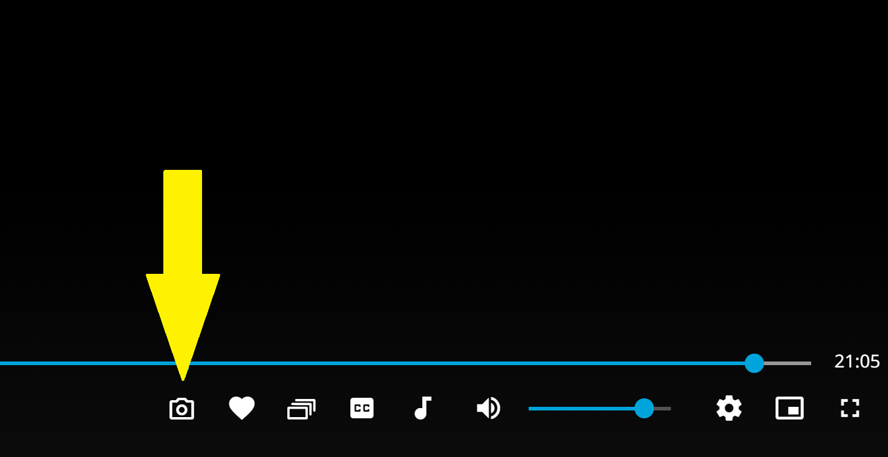

# Jellyfin Auto Screenshot Button

Adds a screenshot button to the **Jellyfin Web UI video player**, available in the **Video OSD** during playback.

Tested **only on Windows 11** with **Chrome**.

---

## Features

- **Single click** → takes a screenshot of the current frame  
- **Hold click** → takes screenshots continuously every 0.2 seconds (rapid-fire mode)  
- **Double click** → toggles **auto mode**, taking a screenshot every second automatically  
  - Auto mode is reset when double click again, leaving/switching video, or page reload
 

---

## Installation

This is a **Userscript / UI tweak** for Jellyfin Web:

1. Copy the script content  
2. Install via a **Userscript manager** (e.g., Tampermonkey) **or inject using Jellyfin's classic JavaScript Injector plugin**, the most common method  
3. Reload Jellyfin Web  
4. During video playback, the **camera button** will appear in the Video OSD next to your rating/favorite buttons

---

## Downloads & File Naming

Download folder:
Uses the system's default Downloads folder.
On Windows, this is the standard Windows Downloads directory of the current user.

Default file naming:
Follows the Windows Snipping Tool naming style, extended with the video title.

Format:
Screenshot YYYY-MM-DD HHMMSS <Video Title>

Example:
Screenshot 2026-01-25 045602 The Simpsons
